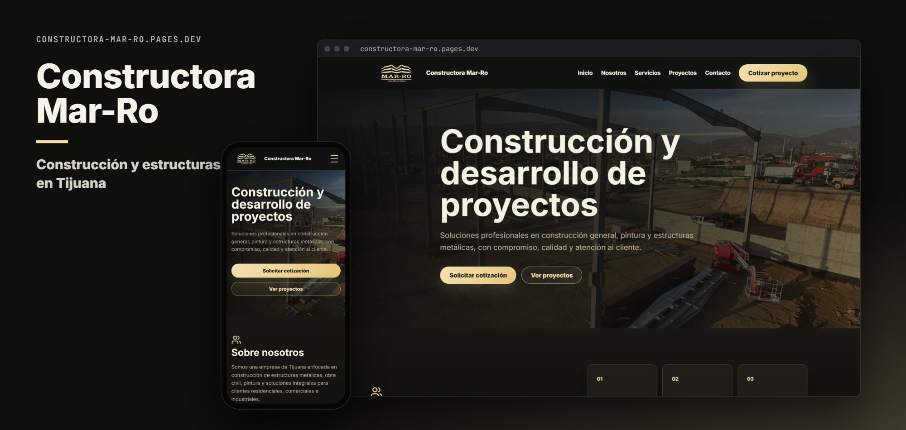
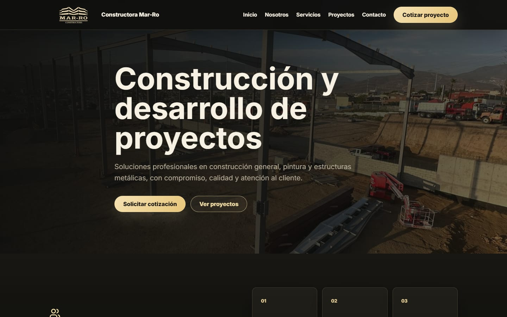
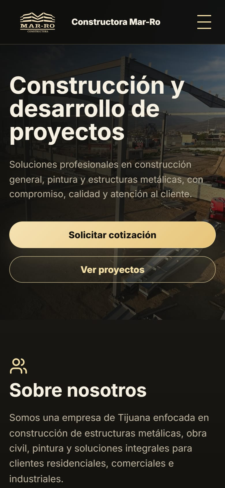

<p align="center">
  
</p>

<h1 align="center">Constructora Mar-Ro</h1>

<p align="center"><b>Construcción y estructuras metálicas en Tijuana</b></p>

<p align="center">
  <a href="https://constructora-mar-ro.pages.dev/"><b>Ver el sitio →</b></a><br><br>
  
  
  
  
</p>

## Sobre el proyecto

Sitio de **Constructora Mar-Ro**, Tijuana: estructuras metálicas, obra civil, pintura y construcción general, con galería de proyectos y una página de detalle por proyecto.

Es un sitio estático: HTML, CSS y JavaScript sin frameworks ni proceso de build.

## Secciones

| Sección | Contenido |
| --- | --- |
| **Inicio** | Nosotros, servicios, proyectos destacados y contacto (`index.html`) |
| **Proyectos** | Galería de todos los proyectos (`proyectos.html`) |
| **Proyecto** | Detalle de cada proyecto (`proyecto.html`), con los datos en `project-data.js` |

## Capturas

<p align="center">
  
  &nbsp;
  
</p>

## Tecnologías

- HTML5, CSS3 y JavaScript, sin frameworks ni proceso de build.
- Íconos de [Lucide](https://lucide.dev/) (desde CDN).
- Tipografía de Google Fonts (Inter).
- Diseño adaptable a celular, tableta y computadora.
- Publicado con **Cloudflare Workers** (assets estáticos, ver `wrangler.jsonc`).

## Estructura

```
Constructora-Mar-Ro/
├── docs/                       # Imágenes de este README
├── index.html                  # Página principal
├── Logo.jpg
├── project-data.js             # Datos de los proyectos
├── proyecto.html               # Detalle de proyecto
├── Proyectos/
├── proyectos.html              # Galería de proyectos
├── script.js                   # Interacciones (menú, animaciones)
├── styles.css                  # Estilos
└── wrangler.jsonc              # Configuración de Cloudflare Workers
```

## Correr en local

No necesita instalar nada. Abre `index.html` en el navegador, o sírvelo desde la carpeta del repo:

```bash
python -m http.server 8000
```

y entra a <http://localhost:8000>.

## Créditos

Desarrollado por [@Salereee](https://github.com/Salereee). Logotipos, fotografías y textos del negocio pertenecen a Constructora Mar-Ro.
