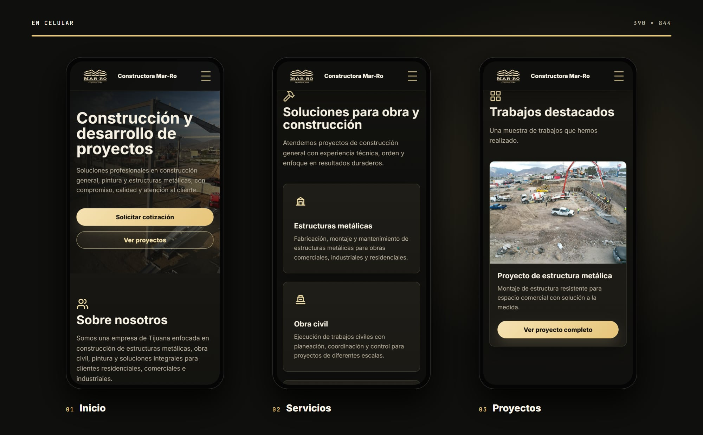

<p align="center">
  
</p>

<h1 align="center">Constructora Mar-Ro</h1>

<p align="center"><b>Construcción y estructuras metálicas en Tijuana</b></p>

<p align="center">
  
  
  
  
</p>

## Sobre el proyecto

Sitio de **Constructora Mar-Ro**, Tijuana: estructuras metálicas, obra civil, pintura y construcción general. Tiene una galería con todos los proyectos y una página de detalle para cada uno, generada a partir de `project-data.js`.

Es un sitio estático, hecho con HTML, CSS y JavaScript, sin frameworks ni proceso de build.

## Secciones

| Sección | Contenido |
| --- | --- |
| **Inicio** | Nosotros, servicios, proyectos destacados y contacto |
| **Proyectos** | Galería de todos los proyectos |
| **Proyecto** | Detalle de cada proyecto con sus fotos |

## En computadora

<p align="center">
  
</p>

## En celular

<p align="center">
  
</p>

## Tecnologías

- HTML5, CSS3 y JavaScript.
- Diseño adaptable a celular, tableta y computadora.
- Íconos de Lucide.
- Tipografía de Google Fonts: Inter.
- Publicado con Cloudflare Workers (assets estáticos, `wrangler.jsonc`).

## Estructura

```
Constructora-Mar-Ro/
├── docs/                   # Imágenes de este README
├── index.html              # Página principal
├── Logo.jpg
├── project-data.js         # Datos de los proyectos
├── proyecto.html           # Detalle de proyecto
├── Proyectos/
├── proyectos.html          # Galería de proyectos
├── script.js               # Interacciones y animaciones
├── styles.css              # Estilos
└── wrangler.jsonc          # Configuración de Cloudflare Workers
```

## Créditos

Desarrollado por Salereee. Logotipos, fotografías y textos del negocio pertenecen a Constructora Mar-Ro.
